# 🐉 DracoGuard — Consensus-Enforced Smart Contract Upgrade Governance

**DracoGuard** is a GenLayer-native autonomous upgrade governance control plane that permanently eliminates the single-point-of-failure in smart contract administration: **centralized admin keys, compromised multisigs, and rogue upgrade proposals**.

In traditional Web3 protocols, smart contract upgrades rely on developer private keys or human multisig signers. If a key is compromised, phished, or socially engineered, malicious bytecode can be installed to drain billions in protocol reserves. 

DracoGuard replaces human admin keys with an **on-chain, validator-enforced AI safety engine**. Target dApps delegate their upgrade slot authority exclusively to DracoGuard. When maintainers submit an upgrade proposal, GenLayer validators non-deterministically fetch the commit-pinned GitHub raw source code diffs, run a multi-tier dragon firewall audit under consensus, enforce a timed dispute window with on-chain evidence snapshots, and execute cross-contract bytecode slot updates only after mathematical and charter safety invariants are proven.

---

## 🐲 The Draco Dragon Security Engine

```mermaid
flowchart TD
    subgraph INGESTION["1. INGESTION & COMMITMENT"]
        A[Candidate Upgrade Proposal Submitted] -->|Commit-Pinned 40-char SHA GitHub URL| B[Non-Deterministic Fetch Baseline & Candidate]
        B -->|Preflight SHA-256 Digest Matching| C[Lock Source Code Digest on Ledger]
    end

    subgraph FIREWALLS["2. THE 5-TIER DRACO DRAGON FIREWALLS"]
        C --> D{Draco Dragon Validation Engine}
        D -->|Firewall 1: Wyrm Storage Audit| E[Verify State Variable Layout Ordering]
        D -->|Firewall 2: Drake Authority Check| F[Verify DracoGuard Retained as Sole Upgrader]
        D -->|Firewall 3: Leviathan Treasury Guard| G[Audit Value Transfer & Drain Vectors]
        D -->|Firewall 4: Wyvern External Bounds| H[Verify Bounded External Interactions]
        D -->|Firewall 5: Dragon Charter Compliance| I[Audit Semantic Alignment with Governing Charter]
    end

    subgraph CONSENSUS["3. EQUIVALENCE PRINCIPLE CONSENSUS"]
        E & F & G & H & I --> J[Normalize to Structured Boolean Safety Indicators]
        J --> K{Validator Consensus Match}
        K -->|100% Agreement on All Booleans & Medium/High Confidence| L[Stage: APPROVED_DISPUTE_WINDOW]
        K -->|Consensus Rejection| M[Stage: REJECTED]
        K -->|Validator Disagreement / Low Confidence| N[Stage: ABSTAINED]
    end

    subgraph DISPUTE["4. DISPUTE & CHALLENGE WINDOW"]
        L --> O[Start Timed Dispute Window: 300s to 7 Days]
        O -->|Dispute Filed with HTTPS Evidence Link| P[Download & Snapshot Dispute Bytes On-Chain]
        P -->|Re-Evaluate Diff under Consensus| Q{Dispute Upheld?}
        Q -->|Yes: Vulnerability Confirmed| M
        Q -->|No: Dispute Rejected| R[Stage: EXECUTION_QUEUED]
        O -->|Window Closes Without Dispute| R
    end

    subgraph EXECUTION["5. BYTECODE SLOT MUTATION"]
        R --> S[Dispatch Asynchronous Call: WardedTarget.upgrade]
        S --> T[Target Overwrites Bytecode Slot via gl.storage.Root.code]
        T --> U[DracoGuard Reads get_version View Call]
        U -->|Version Matches Candidate Release| V[Stage: EXECUTED & SEALED]
    end

    style D fill:#1e1b4b,stroke:#f59e0b,stroke-width:2px
    style K fill:#1e1b4b,stroke:#ef4444,stroke-width:2px
    style L fill:#064e3b,stroke:#10b981,stroke-width:2px
    style V fill:#4c1d95,stroke:#a855f7,stroke-width:2px
```



---

## 🛡 Architectural Guarantees & Security Invariants

1. **Exclusive Authority Delegation:** Target contracts enroll into DracoGuard via internal cross-contract message calls (`enroll_with_dracoguard`). DracoGuard checks `is_sole_guard_authorized()` in the target's system root to guarantee no alternative admin keys retain backdoor upgrade permissions.
2. **Commit-Pinned Code Immutability:** Both baseline and candidate codes must be hosted on commit-pinned raw GitHub URLs (`raw.githubusercontent.com/<org>/<repo>/<40-char-sha>/...`). Mutable branch references (such as `main` or `dev`) revert immediately during input validation.
3. **Resilient Equivalence Principle Normalization:** To prevent consensus splits caused by subtle phrasing differences in LLM prose, DracoGuard normalizes validation results into a strict tuple of boolean flags: `(storage_layout_safe, controller_authority_intact, treasury_movement_safe, external_calls_bounded, charter_aligned, zero_critical_vulnerabilities)`. The qualitative rationale is stored on-chain for human review but excluded from validator equivalence checks.
4. **On-Chain Dispute Evidence Snapshotting:** Community observers can file disputes by submitting HTTPS evidence links. DracoGuard downloads and permanently binds the raw evidence bytes into contract storage, preventing malicious or moving target URLs from altering review context.
5. **Truthful Post-Upgrade Release Confirmation:** A proposal is only sealed as `EXECUTED` after DracoGuard performs an on-chain view query to the target contract verifying that `get_version()` matches the proposed release string.

---

## 📜 Interface Methods Reference

### `DracoGuard` Upgrade Controller Contract

| Method Name | Mutability | Inputs | Purpose |
| :--- | :--- | :--- | :--- |
| `enroll_target` | Write | `target_id: str, name: str, charter: str, source_url: str` | Registers a protected target dApp (invoked by the target contract). |
| `grant_maintainer` | Write | `target_id: str, operator: Address, active: bool` | Grants or revokes maintainer privileges for a target. |
| `propose_upgrade` | Write | `proposal_id: str, target_id: str, candidate_url: str, proposed_version: str, changelog: str` | Submits candidate bytecode for dragon engine consensus audit. |
| `audit_proposal` | Write | `proposal_id: str` | Triggers multi-validator AI consensus code diff audit. |
| `file_dispute` | Write | `proposal_id: str, evidence_url: str, rationale: str` | Opens a dispute with on-chain HTTPS evidence snapshot. |
| `audit_dispute` | Write | `proposal_id: str` | Re-evaluates proposal with snapshotted dispute evidence under consensus. |
| `dispatch_upgrade` | Write | `proposal_id: str` | Emits asynchronous bytecode slot update to the target contract. |
| `retry_dispatch` | Write | `proposal_id: str` | Retries queued bytecode upgrade dispatch with cooldown safety checks. |
| `verify_and_finalize` | Write | `proposal_id: str` | Confirms upgrade installation by querying target version on-chain. |
| `withdraw_proposal` | Write | `proposal_id: str` | Cancels a pending proposal before bytecode dispatch. |
| `suspend_target` | Write | `target_id: str` | Suspends target dApp governance protection. |
| `fetch_overview` | View | None | Returns high-level governance statistics. |
| `fetch_target` | View | `target_id: str` | Reads registered target dApp parameters. |
| `fetch_proposal` | View | `proposal_id: str` | Reads comprehensive proposal details and consensus audit flags. |
| `list_all_targets` | View | `offset: u256, limit: u256` | Paginated listing of all enrolled target dApps. |
| `list_target_proposals` | View | `target_id: str, offset: u256, limit: u256` | Paginated listing of upgrade proposals. |
| `fetch_operator_profile` | View | `account: Address` | Returns targets and proposals associated with an operator address. |

### `WardedTarget` Reference Implementation Template

| Method Name | Mutability | Inputs | Purpose |
| :--- | :--- | :--- | :--- |
| `enroll_with_dracoguard` | Write | `target_id: str, name: str, charter: str, source_url: str` | Triggers cross-contract call to enroll with DracoGuard controller. |
| `increment_counter` | Write | None | Public method incrementing state counter. |
| `add_value` | Write | `amount: u256` | V2 upgrade method demonstrating layout-compatible state additions. |
| `upgrade` | Write | `new_code: bytes` | Replaces contract bytecode slot (restricted strictly to DracoGuard). |
| `get_counter_value` | View | None | Reads active counter state. |
| `get_version` | View | None | Returns active release string (`v1`, `v2`, etc.). |
| `get_guard_controller` | View | None | Returns linked DracoGuard controller address. |
| `get_administrator` | View | None | Returns target administrator address. |
| `is_sole_guard_authorized` | View | None | Verifies DracoGuard is the exclusive upgrader in GenLayer system root. |

---

## 🛠 Project Execution & Verification Guide

### 1. Run Automated Unit Tests (Off-Chain VM Mock)
Ensure dependencies are installed, then execute the pytest test suite:
```bash
python3 -m pytest tests/direct -v
```
All **45 unit test cases** covering constructor limits, input validation bounds, authority checks, and storage layout compatibility will execute and pass.

### 2. Run End-to-End Integration Tests (StudioNet Flow)
To execute the complete deployment, enrollment, preflight digest validation, consensus audit, dispute window, bytecode slot dispatch, and version verification cycle on StudioNet:
```bash
python3 -m pytest tests/integration/test_dracoguard_flow.py -v -s
```

### 3. Verify Deployed Schema
Ensure your environment variable `NEXT_PUBLIC_DRACOGUARD_CONTRACT` is set in `.env`, then check method schema:
```bash
npm run verify:schema
```

### 4. Build & Launch Next.js Dashboard
To compile the cyber-terminal web application:
```bash
npm run build
npm run start
```
The interface includes:
- **PayPer-Style Single-Scroll Landing Cover** with prominent CTA navigation.
- **Interactive 6-Slide Architecture Pitch Deck** with keyboard and control navigation.
- **Full Governance Workbench** with Target Registries, Safety Matrices, and real-time transaction dispatch triggers.

---

## 🌐 Network Configuration

- **Target Network:** GenLayer StudioNet
- **RPC Endpoint:** `https://studio.genlayer.com/api`
- **Chain ID:** `0xF22F` (61999)
- **Explorer:** `https://explorer-studio.genlayer.com`
- **Native Token:** `GEN` (18 decimals)
