# ByteWard v1 — Autonomous Smart Contract Upgrade Control Plane

[](https://studio.genlayer.com)
[-38bdf8?style=flat-square)](https://explorer-studio.genlayer.com)
[](https://explorer-studio.genlayer.com/address/0x7b924FC388EFB82e4BD856395f146dbAF78559B5)
[]()
[]()

**ByteWard** is an autonomous, validator-enforced smart contract upgrade control plane native to [GenLayer](https://genlayer.com). It permanently eliminates the single point of failure in decentralized applications: **centralized admin keys, vulnerable multisigs, and rogue upgrade proposals**.

---

## Network & Live Deployment Information

| Parameter | Value |
| :--- | :--- |
| **Network** | GenLayer StudioNet |
| **Chain ID** | `0xF22F` (61999) |
| **RPC Endpoint** | `https://studio.genlayer.com/api` |
| **Explorer** | `https://explorer-studio.genlayer.com` |
| **Deployed Controller Contract** | [`0x7b924FC388EFB82e4BD856395f146dbAF78559B5`](https://explorer-studio.genlayer.com/address/0x7b924FC388EFB82e4BD856395f146dbAF78559B5) |
| **Verified Public Methods** | 17 Active Methods |
| **Dispute Timelock Window** | 300 seconds (5 minutes) |
| **Native Token** | `GEN` (18 Decimals) |

---

## Development Roadmap

- [x] **Phase 1 (Current Live Build):** Pure validator-enforced AI diff audit, 5-tier Sentinel firewalls, HTTPS dispute evidence snapshotting, and cross-contract bytecode slot mutation on StudioNet.
- [ ] **Phase 2 (Cryptoeconomic Guardrails):** Native `GEN` escrow deposits for proposals, stake-to-challenge bonding to eliminate griefing, malicious upgrade slashing, and automated whitehat bug bounty disbursements.
- [ ] **Phase 3 (Cross-Chain L2 Control Plane):** Cross-chain messaging bridges enabling ByteWard on GenLayer to govern proxy bytecode updates on Arbitrum, Optimism, Base, and Ethereum mainnet.
- [ ] **Phase 4 (Zero-Knowledge AST Proofs):** Pairing GenLayer natural language semantic audits with formal ZK bytecode verification for mathematically proven upgrades.

---

## The Problem: The Web3 Upgradability Trilemma

In traditional smart contract architectures, developers face an irreconcilable trade-off:

```
                  THE UPGRADABILITY TRILEMMA
                  
                   [1. Static Immutability]
                   • Zero feature evolution
                   • Unpatchable zero-day bugs
                            /\
                           /  \
                          /    \
                         /      \
                        /        \
 [2. Centralized Admin Keys] ---- [3. Multisig Quorums]
 • Key leaks & SIM swaps           • Low quorum collusion
 • Rogue developer drains          • Social engineering attacks
```

- Over **$2.8 Billion** has been lost in DeFi to compromised developer private keys, phished multisig signers, and stealth malicious proxy upgrades.
- When human keys hold upgrade authority, any key compromise results in an **instant, irreversible protocol drain**.

---

## The Solution: The ByteWard Sentinel Engine

ByteWard eliminates human admin keys from the upgrade pipeline by transferring exclusive upgrade authority to an **on-chain, multi-validator AI consensus firewall**.

1. **Exclusive Authority Delegation:** Target smart contracts delegate their root upgrader slot strictly to the ByteWard controller contract (`is_sole_guard_authorized() == True`).
2. **Commit-Pinned Ingestion:** Upgrades must be submitted via immutable 40-character commit SHA GitHub raw URLs. Mutable branch references (such as `main` or `dev`) are deterministically rejected.
3. **5-Tier Sentinel Firewalls:** GenLayer AI validators non-deterministically fetch baseline and candidate bytecode diffs, executing five rigorous safety audits under consensus.
4. **Structured Equivalence Normalization:** Qualitative natural language review prose is preserved on-chain for human inspection, while consensus matching operates on a normalized tuple of strict boolean safety invariants.
5. **On-Chain Dispute Snapshots:** Proposals enter a timelocked challenge window where community whitehats can submit HTTPS evidence links. ByteWard snapshots the raw evidence bytes permanently into contract storage to prevent dynamic URL tampering.
6. **Automated Cross-Contract Bytecode Slot Mutation:** Bytecode replacement is dispatched only when consensus verifies safety invariants and confirms truthful post-upgrade version installation.

---

## Architecture & Lifecycle Pipeline

```mermaid
flowchart TD
    subgraph INGESTION["1. INGESTION & DIGEST COMMITMENT"]
        A[Candidate Upgrade Proposal Submitted] -->|Commit-Pinned 40-char SHA URL| B[Non-Deterministic Fetch Baseline & Candidate]
        B -->|Preflight SHA-256 Digest Matching| C[Lock Source Code Digest on Ledger]
    end

    subgraph FIREWALLS["2. THE 5-TIER SENTINEL AUDIT FIREWALLS"]
        C --> D{ByteWard Sentinel Engine}
        D -->|Firewall 1: Storage Layout Audit| E[Verify State Variable Layout & Slot Ordering]
        D -->|Firewall 2: Authority Check| F[Confirm ByteWard Retained as Sole Upgrader]
        D -->|Firewall 3: Treasury Safety Guard| G[Audit Asset Transfers & Block Drain Vectors]
        D -->|Firewall 4: External Call Bounds| H[Verify Bounded Cross-Contract Invocations]
        D -->|Firewall 5: Charter Compliance| I[Audit Semantic Alignment with Governing Charter]
    end

    subgraph CONSENSUS["3. EQUIVALENCE PRINCIPLE CONSENSUS"]
        E & F & G & H & I --> J[Normalize to Structured Boolean Safety Tuple]
        J --> K{Validator Equivalence Match}
        K -->|100% Agreement on All Booleans & Confidence >= Medium| L[Stage: APPROVED_DISPUTE_WINDOW]
        K -->|Consensus Rejection| M[Stage: REJECTED]
        K -->|Validator Disagreement / Low Confidence| N[Stage: ABSTAINED]
    end

    subgraph DISPUTE["4. TIMELOCKED DISPUTE & CHALLENGE WINDOW"]
        L --> O[Start Timed Dispute Window: 300s to 7 Days]
        O -->|Dispute Filed with HTTPS Evidence Link| P[Download & Snapshot Dispute Bytes On-Chain]
        P -->|Re-Evaluate Diff with Evidence under Consensus| Q{Dispute Upheld?}
        Q -->|Yes: Vulnerability Confirmed| M
        Q -->|No: Dispute Rejected| R[Stage: EXECUTION_QUEUED]
        O -->|Window Expires Without Dispute| R
    end

    subgraph EXECUTION["5. BYTECODE SLOT MUTATION & CONFIRMATION"]
        R --> S[Dispatch Asynchronous Call: WardedTarget.upgrade]
        S --> T[Target Overwrites Bytecode Slot via gl.storage.Root.code]
        T --> U[ByteWard Queries get_version View Call]
        U -->|Version Truthfully Matches Candidate Release| V[Stage: EXECUTED & SEALED]
    end

    style D fill:#0f172a,stroke:#38bdf8,stroke-width:2px
    style K fill:#0f172a,stroke:#f59e0b,stroke-width:2px
    style L fill:#064e3b,stroke:#10b981,stroke-width:2px
    style V fill:#1e1b4b,stroke:#a855f7,stroke-width:2px
```



---

## The 5-Tier Sentinel Firewalls

| # | Firewall Name | Purpose & Verification Invariant |
| :-: | :--- | :--- |
| **1** | **State Storage Slot Layout Integrity** | Extracts dataclass variables and state slots. Verifies that candidate releases do not prepend, delete, or reorder variables, eliminating storage collision vulnerabilities. |
| **2** | **Sole Guard Upgrade Authority Check** | Inspects root upgrader permissions and constructor logic to ensure ByteWard remains the exclusive upgrade authority with zero backdoor keys. |
| **3** | **Treasury & Drain Movement Protection** | Scans for arbitrary token/ether transfers, uncontrolled `emit_transfer` calls, or emergency withdrawal functions that could allow attackers to drain funds. |
| **4** | **Bounded External Call Invocations** | Ensures all external cross-contract invocations are bounded to known, verified addresses and safe interfaces, preventing reentrancy and arbitrary delegatecalls. |
| **5** | **Governing Charter Semantic Compliance** | Performs natural language semantic LLM audits under AI consensus verifying candidate changes adhere strictly to the target's immutable governing charter. |

---

## Contract Methods Reference

### `ByteWard` Core Controller Contract (17 Public Methods)

| Method Name | Mutability | Arguments | Description |
| :--- | :---: | :--- | :--- |
| `enroll_target` | Write | `target_id: str, name: str, charter: str, source_url: str` | Registers a protected target dApp (invoked by target contract). |
| `grant_maintainer` | Write | `target_id: str, operator: Address, active: bool` | Grants or revokes maintainer privileges for an enrolled target. |
| `propose_upgrade` | Write | `proposal_id: str, target_id: str, candidate_url: str, proposed_version: str, changelog: str` | Submits candidate bytecode for validator consensus audit. |
| `audit_proposal` | Write | `proposal_id: str` | Triggers multi-validator AI code diff consensus audit. |
| `file_dispute` | Write | `proposal_id: str, evidence_url: str, rationale: str` | Opens a dispute and snapshots HTTPS evidence bytes on-chain. |
| `audit_dispute` | Write | `proposal_id: str` | Re-evaluates proposal with snapshotted dispute evidence under consensus. |
| `dispatch_upgrade` | Write | `proposal_id: str` | Emits cross-contract bytecode slot update to target contract. |
| `retry_dispatch` | Write | `proposal_id: str` | Retries queued bytecode upgrade dispatch with safety backoff. |
| `verify_and_finalize` | Write | `proposal_id: str` | Confirms upgrade installation by querying target version on-chain. |
| `withdraw_proposal` | Write | `proposal_id: str` | Cancels a pending proposal before bytecode dispatch. |
| `suspend_target` | Write | `target_id: str` | Suspends target dApp governance protection. |
| `fetch_overview` | View | None | Returns high-level governance statistics (targets, proposals, approvals). |
| `fetch_target` | View | `target_id: str` | Reads registered target dApp parameters and charter. |
| `fetch_proposal` | View | `proposal_id: str` | Reads full proposal details and 5-tier consensus audit flags. |
| `list_all_targets` | View | `offset: u256, limit: u256` | Paginated listing of all enrolled target dApps. |
| `list_target_proposals` | View | `target_id: str, offset: u256, limit: u256` | Paginated listing of upgrade proposals for a target. |
| `fetch_operator_profile` | View | `account: Address` | Returns targets and proposals associated with an operator address. |

---

### `WardedTarget` Reference Implementation Template

| Method Name | Mutability | Arguments | Description |
| :--- | :---: | :--- | :--- |
| `enroll_with_byteward` | Write | `target_id: str, name: str, charter: str, source_url: str` | Triggers cross-contract call to enroll with ByteWard controller. |
| `increment_counter` | Write | None | Increments state counter. |
| `add_value` | Write | `amount: u256` | V2 upgrade method demonstrating layout-compatible state addition. |
| `upgrade` | Write | `new_code: bytes` | Replaces contract bytecode slot (strictly restricted to ByteWard). |
| `get_counter_value` | View | None | Reads active counter state. |
| `get_version` | View | None | Returns active release version string (`v1`, `v2`, etc.). |
| `get_guard_controller` | View | None | Returns linked ByteWard controller address. |
| `get_administrator` | View | None | Returns target administrator address. |
| `is_sole_guard_authorized` | View | None | Verifies ByteWard is the exclusive upgrader in GenLayer system root. |

---

## Dual-Mode Frontend Architecture

The user interface delivers a modern dual-mode web experience:

1. **Cinematic Landing Cover (100vh Single Viewport):**
   - Full-bleed edge-to-edge cyber-terminal gateway background.
   - Translucent frosted glass `LAUNCH →` action button with interactive hover zoom.
   - Zero vertical scroll overflow on initial load.
2. **Executive Control Plane Dashboard (Off-White Canvas):**
   - Clean, luxury off-white theme (`#f6f8fb`) with obsidian text and frosted white cards.
   - **Segmented Pill Navigation Control** (`Dashboard`, `Protected Targets`, `Proposals Ledger`) with active status indicators.
   - **4-Card KPI Strip:** Protected Targets, Proposals Submitted, Consensus Approvals, Executed Updates.
   - **Structured Dual-Column Workbench:**
     - *Left Column (60%):* Active Upgrade Proposals Ledger with compact 5-tier firewall check chips, changelog narratives, and execution triggers.
     - *Right Column (40%):* Registered Targets Registry and Sentinel Engine Specification panel.
   - **Frosted Sticky Header Shield:** Top navigation stays fixed with a frosted glass backdrop, preventing content from bleeding underneath during scrolling.
   - **Brand Logo Navigation:** Clicking `BYTEWARD v1` at the top left returns you to the landing cover screen anytime.

---

## Testing & Verification Guide

### 1. Run Unit Tests (Off-Chain VM Mock)
Execute all 54 unit test cases verifying constructor bounds, storage layout invariants, and authority checks:
```bash
python3 -m pytest tests/direct -v
```
**Result:** 54 passed in ~0.5s.

### 2. Run End-to-End Integration Tests (StudioNet Flow)
To execute the complete deployment, enrollment, preflight digest validation, multi-validator AI consensus audit, dispute timelock, and bytecode slot dispatch cycle:
```bash
python3 -m pytest tests/integration/test_byteward_flow.py -v -s
```

### 3. Verify Deployed Contract Schema
Confirm that the live StudioNet deployment has 17 active methods matching the ABI:
```bash
npm run verify:schema
```

### 4. Build & Launch Next.js Application
Compile the production frontend with Turbopack:
```bash
npm run build
npm run start
```

---

## License

This project is open-source and released under the [MIT License](LICENSE).
